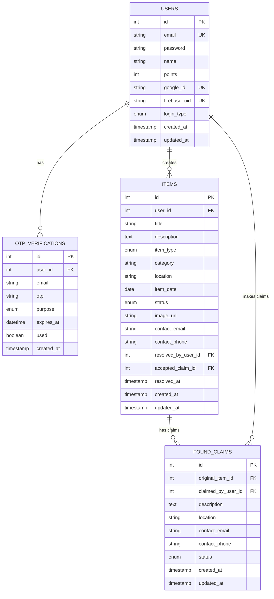
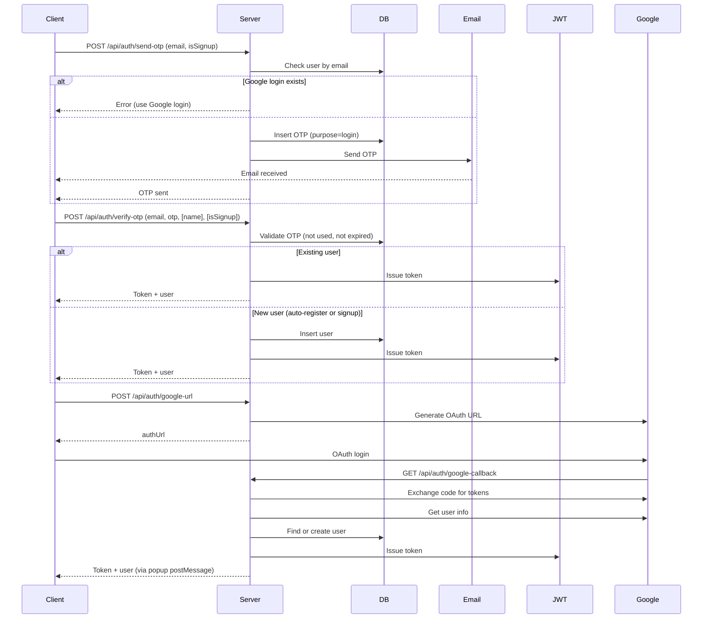
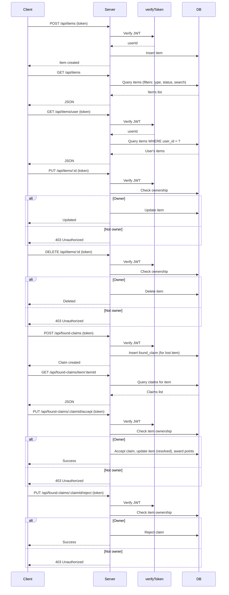
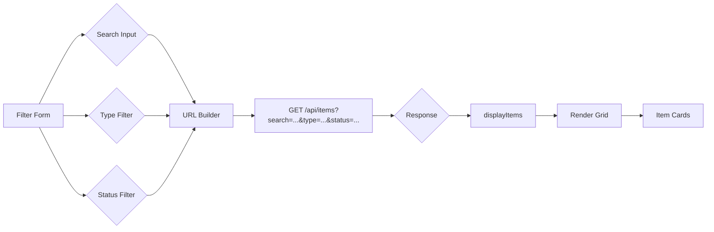

# Lost & Found Application - Architecture Documentation

## Database Schema

### Table Details

#### Users

| Column              | Type         | Constraints                                   |
|---------------------|--------------|-----------------------------------------------|
| `id`                | INT          | PRIMARY KEY, AUTO_INCREMENT                   |
| `email`             | VARCHAR(255) | UNIQUE, NOT NULL                              |
| `password`          | VARCHAR(255) | Optional (for email login only)               |
| `name`              | VARCHAR(255) | NOT NULL                                      |
| `points`            | INT          | DEFAULT 0                                     |
| `google_id`         | VARCHAR(255) | UNIQUE, Optional (for Google login)           |
| `firebase_uid`      | VARCHAR(255) | UNIQUE, Optional                              |
| `login_type`        | ENUM         | 'email', 'google', DEFAULT 'email'            |
| `created_at`        | TIMESTAMP    | DEFAULT CURRENT_TIMESTAMP                     |
| `updated_at`        | TIMESTAMP    | DEFAULT CURRENT_TIMESTAMP ON UPDATE           |

#### OTP Verifications

| Column      | Type         | Constraints                                   |
|-------------|--------------|-----------------------------------------------|
| `id`        | INT          | PRIMARY KEY, AUTO_INCREMENT                   |
| `user_id`   | INT          | FOREIGN KEY → users(id), Nullable             |
| `email`     | VARCHAR(255) | Indexed                                       |
| `otp`       | VARCHAR(6)   | NOT NULL                                      |
| `purpose`   | ENUM         | 'password_reset', 'email_verification', 'login', DEFAULT 'login' |
| `expires_at`| DATETIME     | NOT NULL                                      |
| `used`      | BOOLEAN      | DEFAULT FALSE                                 |
| `created_at`| TIMESTAMP    | DEFAULT CURRENT_TIMESTAMP                     |

#### Items

| Column               | Type         | Constraints                                   |
|----------------------|--------------|-----------------------------------------------|
| `id`                 | INT          | PRIMARY KEY, AUTO_INCREMENT                   |
| `user_id`            | INT          | FOREIGN KEY → users(id), NOT NULL             |
| `title`              | VARCHAR(255) | NOT NULL                                      |
| `description`        | TEXT         | Optional                                      |
| `item_type`          | ENUM         | 'lost', 'found', NOT NULL                     |
| `category`           | VARCHAR(100) | Optional                                      |
| `location`           | VARCHAR(255) | Optional                                      |
| `item_date`          | DATE         | Optional                                      |
| `status`             | ENUM         | 'active', 'resolved', 'claimed', 'found', DEFAULT 'active' |
| `image_url`          | VARCHAR(255) | Optional                                      |
| `contact_email`      | VARCHAR(255) | Optional                                      |
| `contact_phone`      | VARCHAR(20)  | Optional                                      |
| `resolved_by_user_id`| INT          | FOREIGN KEY → users(id), Nullable             |
| `accepted_claim_id`  | INT          | FOREIGN KEY → found_claims(id), Nullable      |
| `resolved_at`        | TIMESTAMP    | Nullable                                      |
| `created_at`         | TIMESTAMP    | DEFAULT CURRENT_TIMESTAMP                     |
| `updated_at`         | TIMESTAMP    | DEFAULT CURRENT_TIMESTAMP ON UPDATE           |

#### Found Claims

| Column               | Type         | Constraints                                   |
|----------------------|--------------|-----------------------------------------------|
| `id`                 | INT          | PRIMARY KEY, AUTO_INCREMENT                   |
| `original_item_id`   | INT          | FOREIGN KEY → items(id), NOT NULL             |
| `claimed_by_user_id` | INT          | FOREIGN KEY → users(id), NOT NULL             |
| `description`        | TEXT         | Optional                                      |
| `location`           | VARCHAR(255) | Optional                                      |
| `contact_email`      | VARCHAR(255) | Optional                                      |
| `contact_phone`      | VARCHAR(20)  | Optional                                      |
| `status`             | ENUM         | 'pending', 'accepted', 'rejected', DEFAULT 'pending' |
| `created_at`         | TIMESTAMP    | DEFAULT CURRENT_TIMESTAMP                     |
| `updated_at`         | TIMESTAMP    | DEFAULT CURRENT_TIMESTAMP ON UPDATE           |

**Indexes:**
- `idx_items_user_id` on items(user_id)
- `idx_items_type` on items(item_type)
- `idx_items_status` on items(status)
- `idx_items_resolved_at` on items(resolved_at)
- `idx_items_resolved_by` on items(resolved_by_user_id)
- `idx_otp_user_id` on otp_verifications(user_id)
- `idx_email` on otp_verifications(email)
- `idx_otp` on otp_verifications(otp)
- `idx_original_item_id` on found_claims(original_item_id)
- `idx_claimed_by_user_id` on found_claims(claimed_by_user_id)
- `idx_status` on found_claims(status)
- `idx_users_email` on users(email)
- `idx_users_login_type` on users(login_type)

---

## Server Architecture

```mermaid
graph TD
    A[Express Server :3000] --> B[CORS Middleware]
    A --> C[JSON Parser]
    A --> D[Static Files]
    A --> E[Cookie Parser]
    A --> F[Firebase Admin SDK]
    A --> G[Google OAuth2 Client]
    A --> H[Nodemailer]

    A --> I[Auth Routes]
    A --> J[Item Routes]
    A --> K[Found Claims Routes]
    A --> L[User Points Route]
    A --> M[Debug Route]

    I --> I1[POST /api/auth/send-otp]
    I --> I2[POST /api/auth/check-email]
    I --> I3[POST /api/auth/verify-otp]
    I --> I4[POST /api/auth/google-url]
    I --> I5[GET /api/auth/google-callback]
    I --> I6[GET /api/auth/google-status]

    J --> J1[GET /api/items]
    J --> J2[GET /api/items/user]
    J --> J3[GET /api/items/:id]
    J --> J4[POST /api/items]
    J --> J5[PUT /api/items/:id]
    J --> J6[DELETE /api/items/:id]
    J --> J7[PUT /api/items/:id/mark-found]
    J --> J8[PUT /api/items/:id/mark-claimed]

    K --> K1[POST /api/found-claims]
    K --> K2[GET /api/found-claims/item/:itemId]
    K --> K3[GET /api/found-claims/user]
    K --> K4[PUT /api/found-claims/:claimId/accept]
    K --> K5[PUT /api/found-claims/:claimId/reject]

    L --> L1[GET /api/users/points]
```

### Authentication & OTP Flow

### Item & Claim Management Flow

---

## Client Search & Filter Logic

### Filter Parameters

| Parameter | Type   | Values                                 |
|-----------|--------|----------------------------------------|
| `search`  | String | Searches title & description           |
| `type`    | String | lost, found                            |
| `status`  | String | active, resolved, claimed, found       |

---

## Additional Notes

- **Points System:** Users receive points (e.g., +10) when their found claim is accepted.
- **Google Login:** Supported via OAuth2; users with Google login cannot use email OTP login.
- **OTP:** Used for both login and signup; expires in 5 minutes; purpose tracked.
- **Claims:** Users can submit claims on lost items; item owner can accept/reject.
- **Resolved Items:** When a claim is accepted, the item is marked as resolved, and claim/user details are linked.
- **Indexes:** All major foreign keys and frequently queried fields are indexed for performance.

