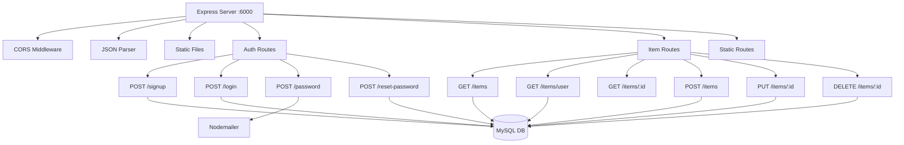
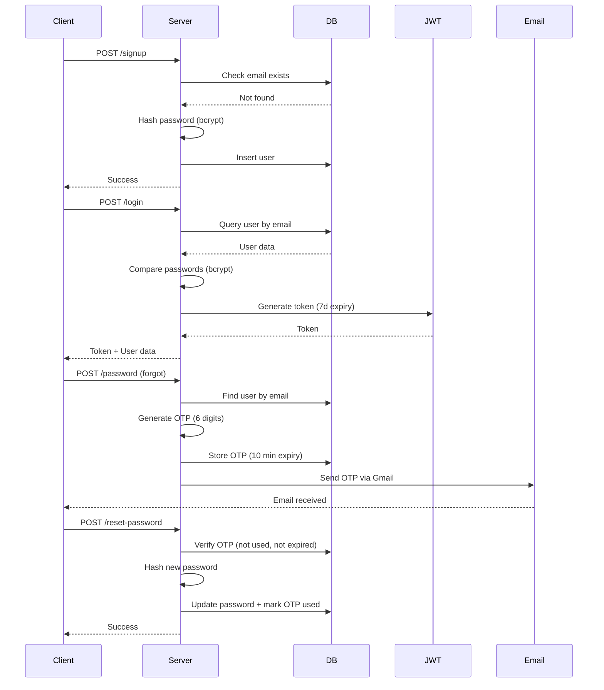
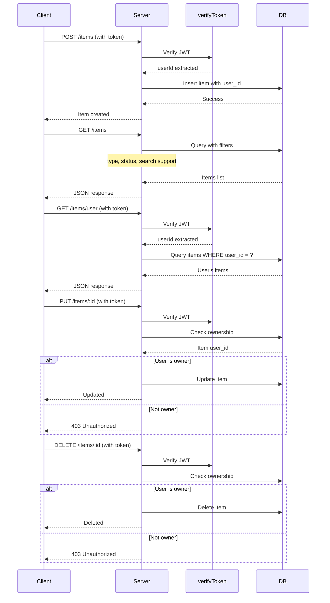
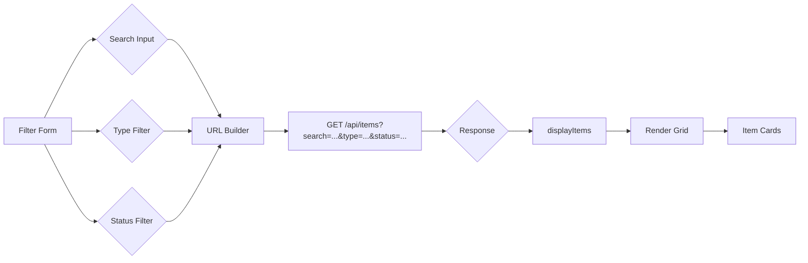

# Lost & Found Application - Architecture Documentation

## Database Schema

```mermaid
erDiagram
    USERS ||--o{ OTP_VERIFICATIONS : "has"}
    USERS ||--o{ ITEMS : "creates"}

    USERS {
        int id PK
        string email UK
        string password
        string name
        timestamp created_at
        timestamp updated_at
    }

    OTP_VERIFICATIONS {
        int id PK
        int user_id FK
        string otp
        enum purpose
        datetime expires_at
        boolean used
        timestamp created_at
    }

    ITEMS {
        int id PK
        int user_id FK
        string title
        text description
        enum item_type
        string category
        string location
        date item_date
        enum status
        string image_url
        string contact_email
        string contact_phone
        timestamp created_at
        timestamp updated_at
    }
```

### Table Details

#### Users
Stores user account information with authentication support.

| Column | Type | Constraints |
|--------|------|-----------|
| `id` | INT | PRIMARY KEY, AUTO_INCREMENT |
| `email` | VARCHAR(255) | UNIQUE, NOT NULL |
| `password` | VARCHAR(255) | NOT NULL (bcrypt hashed) |
| `name` | VARCHAR(255) | NOT NULL |
| `created_at` | TIMESTAMP | DEFAULT CURRENT_TIMESTAMP |
| `updated_at` | TIMESTAMP | AUTO UPDATE |

#### OTP Verifications
Manages one-time passwords for password resets and email verification.

| Column | Type | Constraints |
|--------|------|-----------|
| `id` | INT | PRIMARY KEY, AUTO_INCREMENT |
| `user_id` | INT | FOREIGN KEY → users(id) |
| `otp` | VARCHAR(6) | NOT NULL |
| `purpose` | ENUM | password_reset, email_verification |
| `expires_at` | DATETIME | NOT NULL (10 min expiry) |
| `used` | BOOLEAN | DEFAULT FALSE |
| `created_at` | TIMESTAMP | DEFAULT CURRENT_TIMESTAMP |

#### Items
Stores lost and found item listings.

| Column | Type | Constraints |
|--------|------|-----------|
| `id` | INT | PRIMARY KEY, AUTO_INCREMENT |
| `user_id` | INT | FOREIGN KEY → users(id) |
| `title` | VARCHAR(255) | NOT NULL |
| `description` | TEXT | Optional |
| `item_type` | ENUM | lost, found |
| `category` | VARCHAR(100) | Optional |
| `location` | VARCHAR(255) | Optional |
| `item_date` | DATE | Optional |
| `status` | ENUM | active, resolved, claimed |
| `image_url` | VARCHAR(255) | Optional |
| `contact_email` | VARCHAR(255) | Optional |
| `contact_phone` | VARCHAR(20) | Optional |
| `created_at` | TIMESTAMP | DEFAULT CURRENT_TIMESTAMP |
| `updated_at` | TIMESTAMP | AUTO UPDATE |

**Indexes:**
- `idx_items_user_id` on user_id
- `idx_items_type` on item_type
- `idx_items_status` on status
- `idx_otp_user_id` on user_id

---

## Server Architecture



### Authentication Flow



### Item Management Flow



---

## Client Search & Filter Logic



### Filter Parameters

| Parameter | Type | Values |
|-----------|------|--------|
| `search` | String | Searches title & description |
| `type` | String | lost, found |
| `status` | String | active, resolved, claimed |
